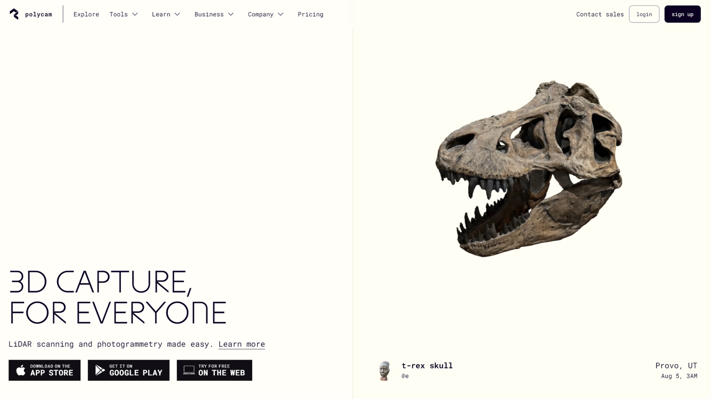
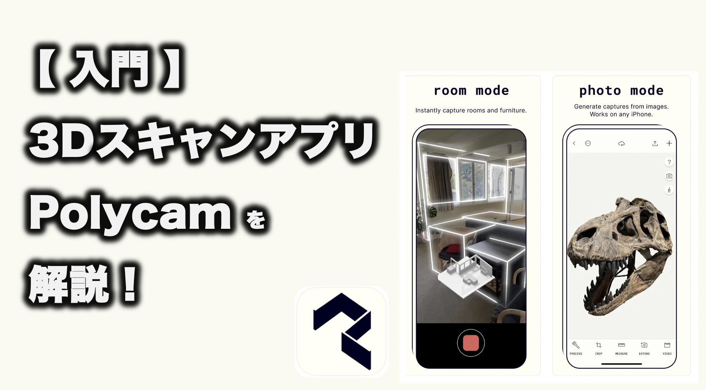

# Polycamを使用したフォトグラメトリの手順

[株式会社DREAMSQUARE](https://dreamsquare.tech)　黒田　隆史（くろだ　たかし）

## 0. Polycam概要

- ### 0.1. Polycamって何？（小学3年生以下向け）

    みんなが好きな**マインクラフト**や**Fortnite**の世界には、家や動物、道具がありますよね。そういった物を、私達でも作れるんです。Polycamでは**写真を使って3Dモデルを**作るための道具です。写真を撮って、その写真から**立体的な形**を作り出すことができます。これは、友達に自分の作った作品を見せるのにとっても便利ですよ！

- ### 0.2. Polycamを使うと何ができるの？（小学3年生以下向け）  

    Polycamを使うと、**自分の好きなもの**や**面白いもの**を写真で撮って、それを3Dモデルに変えることができます。例えば、ペットの犬や猫、作った粘土の作品、学校で作った工作など、何でも立体にしてみましょう！その3Dモデルは**友達とシェア**したり、**オンラインで見せ合ったり**できますよ。

- ### 0.3. 無料で利用可能（小学3年生以下向け）

    ここまで聞いて、利用には**沢山のお金**がかかると予想しますよね。しかし、Polycamは、**無料**で利用することができます。また、写真から3Dモデルを**10個**以上作るとお金がかかってきますよ。

## 1. 準備

- ### 1.1. アプリの起動

    まずは、スマホのネット(Google, Edge, etc..)から、**Polycam**と検索しましょう。あとで、App StoreやGoogle Playから簡単にダウンロードすることもできますよ。おうちの人に頼んで、一緒にダウンロードしてもらいましょう。

- ### 1.2. アカウントの作成

    アプリをインストールしたら、次に**アカウント**を作りましょう。これは自分専用のユーザーネームとパスワードを作ることです。おうちの人に手伝ってもらって、**安全なパスワード**を設定しましょう。

- ### 1.3. 初めてのログイン

    アカウントを作ったら、**早速ログイン**してみましょう。ログインすると、Polycamの世界に入ることができます。いろんなメニューがあるけど、まずは写真を撮る準備をしましょう！

## 2. 対象のオブジェクトの写真を撮影

- ### 2.1. 写真を撮る準備（小学3年生以下向け）

    まず、Polycamで3Dモデルにしたいものを選びましょう。それが椅子でも、お気に入りのおもちゃでも、なんでもOKです！今回は、この**恐竜**です。対象物を明るい場所に置いて、周りに障害物がないようにしましょう。

- ### 2.2. 写真の撮り方（小学3年生以下向け）

    Polycamのアプリを開いて、カメラ機能を使って写真を撮ります。対象物の周りをぐるっと回って、いろんな角度から写真を撮ると良いですよ。最低でも30枚くらい撮ると、より良い3Dモデルができます。

- ### 2.3. 写真の確認（小学3年生以下向け）

    撮った写真がちゃんと写っているか確認しましょう。ぼやけている写真や暗すぎる写真はもう一度撮り直しましょう。きれいに撮れた写真が**多い**ほど、**良い**3Dモデルが作れます。

## 3. 写真の取り込み

- ### 3.1. 写真をPolycamに取り込む

    写真が撮れたら、Polycamのアプリでその写真を**取り込みます**。アプリの指示に従って、撮った写真を選んでアップロードしましょう。少し時間がかかるけど、待っている間に他の写真も撮ってみると楽しいですよ。

- ### 3.2. 写真の確認と編集
    取り込んだ写真を**確認**しましょう。必要なら、アプリ内で少し編集もできます。例えば、不要な部分をカットしたり、明るさを調整したりすることができます。

- ### 3.3. 3Dモデルの生成

    写真の取り込みと編集が終わったら、いよいよ3Dモデルを生成します。アプリの「3Dモデルを作成」ボタンを押して、しばらく待ちましょう。どんな立体になるか楽しみですね！

## 4. 処理設定と実行

- ### 4.1. モデルの詳細設定

    3Dモデルができたら、さらに詳細な設定をしましょう。例えば、モデルのサイズを変更したり、色を調整したりすることができます。自分の作品をもっとかっこよくするために、いろいろ試してみましょう。

- ### 4.2. 最終確認

    設定が終わったら、最終確認をしましょう。3Dモデルが自分の思い通りになっているか、しっかりチェックします。問題があれば、もう一度設定を見直してみましょう。

- ### 4.3. 処理の実行

    最終確認が終わったら、処理を実行します。アプリの「処理開始」ボタンを押して、しばらく待ちます。モデルが完成するまで少し時間がかかることがありますが、焦らず待ちましょう。

## 5. 3Dオブジェクトのダウンロード

- ### 5.1. ダウンロードの準備

    3Dモデルが完成したら、いよいよ**ダウンロード**です。ダウンロードするためには、アプリ内で**適切な保存場所**を選びます。例えば、自分のスマホのフォルダやクラウドサービスに保存することができます。

- ### 5.2. 3Dモデルのダウンロード

    **ダウンロードボタン**を押して、自分のスマホやタブレットに3Dモデルを**保存**しましょう。保存した3Dモデルは、いつでも見たり、友達に見せたりすることができます。

- ### 5.3. 共有と活用

    ダウンロードした3Dモデルを友達や家族に見せてみましょう。オンラインで共有したり、SNSにアップロードしたりして、**自分の作品**をみんなに見てもらいましょう。自分の作った作品がどんな反応をもらえるか楽しみですね！

[^1]:<https://www.minecraft.net/ja-jp>
[^2]:<https://www.fortnite.com/>
[^3]:<https://www.roblox.com/ja>
[^3.1]:<https://www.roblox.com/ja/games/17125064572/KURASUSHI-WORLD>
[^3.2]:<https://www.roblox.com/ja/games/17254019855/IKEA-The-Co-Worker>
[^4]:<https://www.blender.org/>
[^5]:<https://poly.cam/>
[^6]:<https://scaniverse.com/>