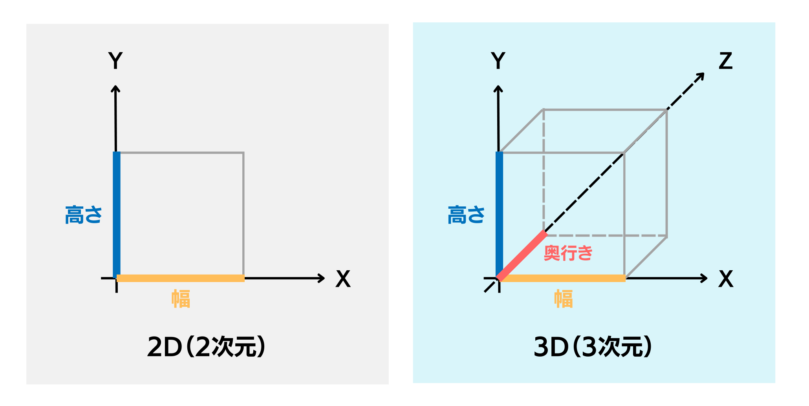

# 3D・バーチャルの世界を知ろう

[株式会社DREAMSQUARE](https://dreamsquare.tech)　安藤 太亮（あんどう たいすけ）

## 本講義の目標

3D・バーチャルについて理解し、フォトグラメトリによって3Dモデルを作れるようになる。

## もくじ

- [3D・バーチャルの世界を知ろう](#3dバーチャルの世界を知ろう)
  - [本講義の目標](#本講義の目標)
  - [もくじ](#もくじ)
  - [1. 3D（スリーディー）とは](#1-3dスリーディーとは)
  - [2. バーチャル（バーチャル空間）とは](#2-バーチャルバーチャル空間とは)
  - [3. バーチャル空間（メタバース空間）の例](#3-バーチャル空間メタバース空間の例)
  - [4. 3Dモデルの作り方（2種類紹介）](#4-3dモデルの作り方2種類紹介)
  - [5. フォトグラメトリのやり方（2種類紹介）](#5-フォトグラメトリのやり方2種類紹介)
  - [6. フォトグラメトリの仕組み（難しい）](#6-フォトグラメトリの仕組み難しい)
  - [まとめ](#まとめ)

## 1. 3D（スリーディー）とは

- ### 1.1. 日常生活での3D（小学3年生以下向け）

    皆さんは、**3D**という言葉を聞いたことはありますか？3Dの**D**は**Dimensional**次元）を表しており、3次元とも言い換えることができます。
    2次元と3次元の違いを簡潔に言い表すと、平べったく見えるものは2次元（2D）、浮き出て見えるものは3次元（3D）です。皆さんが紙に描いた絵は2次元（2D）、段ボールで作ったおもちゃは3次元（3D）です。

- ### 1.2. コンピュータ上での3D（小学3年生以下向け）

    ここまで、日常生活での3Dについて説明しました。では、コンピュータの画面に表示されているものは2Dでしょうか？それとも3Dでしょうか？
    実は、コンピュータに表示されるものには2Dと3Dの両方があります。日常生活での3Dとコンピュータでの3Dの性質に大きな違いはなく、平べったく見るものが2D、浮き出て見えるものが3Dです。
    皆さんは、日常生活では段ボールで工作をするだけで3Dを表現することができると思います。では、コンピュータ上で浮き出て見える3Dはどのようにして作られるのでしょうか？また、どんなところで使われているのでしょうか？
    本講義では、そんなコンピュータ上の3D（以降、3Dと表記）の世界に迫ります。

- ### 1.3. 高学年向けの3Dの解釈

    正方形、長方形、正三角形、円形などの、長さ（底辺）と高さの２つの成分（x軸とy軸とも表される）によって表される形を**2D**、立方体、直方体、円柱のように、長さと高さの他に**奥行き**（z軸とも表される）を成分に持つ形を**3D**と表します。

    

## 2. バーチャル（バーチャル空間）とは

**バーチャル**は日本語で**仮想**を意味します。つまり、バーチャル空間は**仮想空間**を指します。バーチャル空間を簡潔に表すと、3Dの組み合わせによって作られたコンピュータ上の空間です。
例えば、立方体（浮き出て見える四角）の上に四角錐（浮き出て見える三角）を乗せると、家のような形ができます。このような、浮き出て見える**建物**や**人**や**もの**のことを**3Dモデル**といいます。そして、この3Dの家（3Dモデル）をたくさん並べると街が出来上がります。このように、たくさんの3Dモデルを組み合わせて作られた街が**バーチャル空間**です。

## 3. バーチャル空間（メタバース空間）の例

バーチャル空間のうち、様々な人と交流できるインターネット上のバーチャル空間を**メタバース**と呼びます。ここでは、世界中で大人気のメタバース（バーチャル空間）を3つ紹介します。

- ### 3.1. Minecraft[^1]

    Minecraft（マインクラフト）は、ブロックでできた世界で遊ぶゲームです。このゲームでは、プレイヤーが自由にブロックを置いたり壊したりして、自分の好きな建物や街を作ることができます。また、作った街を友達と一緒に遊ぶこともできます。

- ### 3.2. Fortnite[^2]

    Fortnite（フォートナイト）はプレイヤーが自分のキャラクターを操作して、広い3Dの世界で冒険やバトルを楽しむゲームです。ゲームの中でプレイヤーは友達と協力して、建物を作ったり壊したりすることで、敵に攻撃をしたり、敵からの攻撃を守ったりすることが出来ます。また、Fortniteはゲームで遊ぶだけでなく、ゲームの舞台となる3D空間を自分で作ることもできます。

- ### 3.3. Roblox[^3]

    Roblox（ロブロックス）は、たくさんのゲームが集まったインターネット上の遊び場です。このゲームでは、プレイヤーが自分のキャラクターを使って、色々な3D空間で遊ぶことができます。最近では、くら寿司[^3.1]やIKEA[^3.2]がRoblox上に食事や買い物を体験できる空間を公開し、注目を集めています。

## 4. 3Dモデルの作り方（2種類紹介）

次に、バーチャル空間の基となっている3Dモデルを作る方法を2種類紹介します。

- ### 4.1. 単純な図形を組み合わせて3Dを作る方法

    

    上で、立方体と四角錘を組み合わせることで、家が表現できるというお話をしました。立方体や四角錘などの単純な図形を組み合わせることで、家のほかにも様々なものを表現することができます。家の他にも例を挙げると、長細い円柱（浮き出て見える筒）の上に円錐（浮き出て見えるコーン）を置くと、ロケットのような形ができます。このように、単純な図形をコンピュータ上で組み合わせることで、もっと複雑な3Dモデルを作ることができます。
    この方式で3Dモデルを作るには、**Blender**[^4]というコンピュータで動くソフトが必要になります。また、以下にこの方式で3Dモデルを作る際のメリットとデメリットを紹介します。

    **メリット（良いところ）**

    現実には存在しない新しいキャラクターや建物などを作ることができる。

    **デメリット（悪いところ）**

    単純図形を組み合わせて作るため、作業が複雑で時間がかかる。

- ### 4.2 たくさんの写真から3Dモデルを作る方法

    

    上の方式では、単純な3Dの組み合わせによって3Dモデルを作る方法を紹介しました。次に、2D（写真は浮き出て見えないので2D）から3Dを作る方法を紹介します。家を正面から撮った写真が1枚あったとすると、この写真からは家の裏の様子や側面の様子を認識することができません。そこで、同じ家を横から撮った写真、後ろから撮った写真、上から撮った写真を補うことで、家全体の形を認識することができます。このように、3D化するものを様々な角度から写真を撮り、それらの写真をコンピュータ上でつなぎ合わせることで3Dモデルをつくることができます。このように、写真から3Dモデルをつくる技術を**フォトグラメトリ**と呼びます。また、以下にフォトグラメトリのメリットとデメリットを紹介します。

    **メリット（良いところ）**

    スマートフォンで写真を撮るだけで簡単に3Dモデルを作ることができる。

    **デメリット（悪いところ）**

    既存のもの（写真を撮れるもの）からしか3Dモデルを作ることができない。

## 5. フォトグラメトリのやり方（2種類紹介）

次に、上で紹介したフォトグラメトリをスマートフォンで行うことができる2つのアプリの特徴と使い方について説明します。

- ### 5.1 polycam[^5] を使って3Dモデルを作る方法

    polycamは世界で最も使用されているフォトグラメトリのアプリで、最低20枚（無料版の上限は150枚）の写真から3Dモデルを作ることができます。3D化するものを固定して、カメラの方向を変えることで写真を撮る方法の他に、カメラを固定して3D化するものを動かすことで写真を撮る方法にも対応しています。また、アプリをインストールしなくても、Web上に写真をアップロードするだけで、高品質な3Dモデルを作ることができます。polycamの詳しい使い方については、以下のリンクを参照してください。

    [Polycamを使用したフォトグラメトリの手順](Polycam-Manual.md)

- ### 5.2 Scaniverse[^6] 使って3Dモデルを作る方法

    Scaniverseは、スマートフォンを使って簡単に**もの**や**場所**を3Dスキャンできるアプリです。写真を1枚1枚とる形式ではなく、物体の周りをスマホの角度を変えながらゆっくり歩くことで、物体の動画を撮る感覚でスキャンすることができます。Scaniverseを使用するには、スマートフォンにアプリをインストールする必要があります。詳しい使い方については、以下のリンクを参照してください。

    [Scaniverseを使用したフォトグラメトリの手順](Scaniverse-Manual.md)

## 6. フォトグラメトリの仕組み（難しい）

上でフォトグラメトリは、3D化するものを様々な角度から写真を撮り、それらをつなぎ合わせることで3Dモデルを作ることができると紹介しました。では、実際に複数の写真をどのようにしてつなぎ合わせているのでしょうか。写真から3Dモデルが作られる過程を3つに分けて説明します。

- ### 6.1. 特徴点（とくちょうてん）の抽出

    色や形などの違いによる特徴のある点を写真から抽出します。

    

- ### 6.2. メッシュの作成

    同一の特徴点を他の写真からも見つけ、特徴点同士の位置関係を明らかにします。そして、隣接する特徴点を線で結び、三角形を作ります。

    

- ### 6.3. テクスチャの貼り付け

    3つの特徴点で構成される三角形の面に写真から色を抽出して貼り付けます。

    

## まとめ

最後に、本講義に出てきた言葉や概念について振り替えりましょう。

- 長さ、高さの２つの成分で構成される形を（平べったく見えるもの）を**2D**、長さ、高さ、奥行きの３つの成分で構成される形（浮き出て見える形）を**3D**と言います。[1](#1-3dスリーディーとは)
- 建物、キャラクターなどをコンピュータ上で立体的に表現したものを**3Dモデル**と言います。[2](#2-バーチャルバーチャル空間とは)
- 3Dの建物、人、ものを組み合わせて作られた仮想の街（空間）を**バーチャル空間**と言います。[2](#2-バーチャルバーチャル空間とは)
- インターネット上で様々なな人と交流することのできるバーチャル空間を**メタバース**と言います。[3](#3-バーチャル空間メタバース空間の例)
- 3D化したいものを様々な角度から写真を撮り、それらの写真をコンピュータ上で繋ぎ合わせて3Dモデルを作る技術を**フォトグラメトリ**と言います。[4.2](#42-たくさんの写真から3dモデルを作る方法)

[^1]:<https://www.minecraft.net/ja-jp>
[^2]:<https://www.fortnite.com/>
[^3]:<https://www.roblox.com/ja>
[^3.1]:<https://www.roblox.com/ja/games/17125064572/KURASUSHI-WORLD>
[^3.2]:<https://www.roblox.com/ja/games/17254019855/IKEA-The-Co-Worker>
[^4]:<https://www.blender.org/>
[^5]:<https://poly.cam/>
[^6]:<https://scaniverse.com/>
