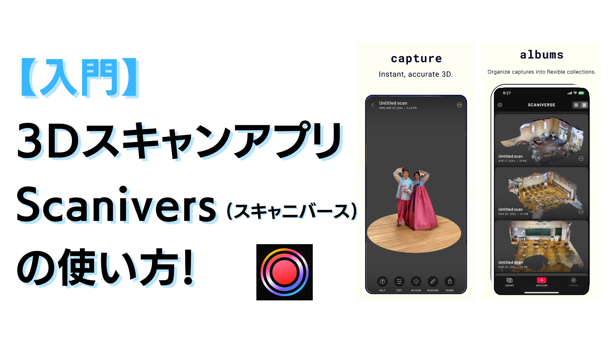
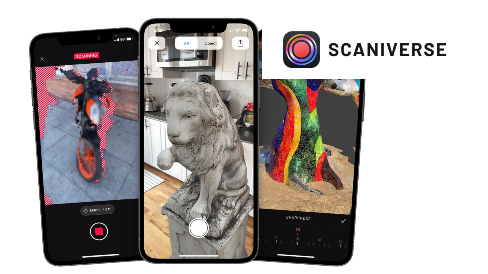
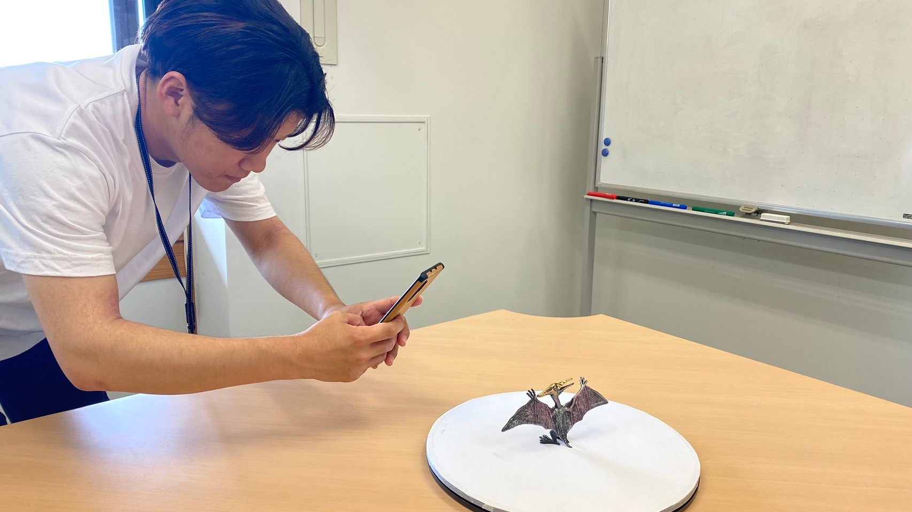
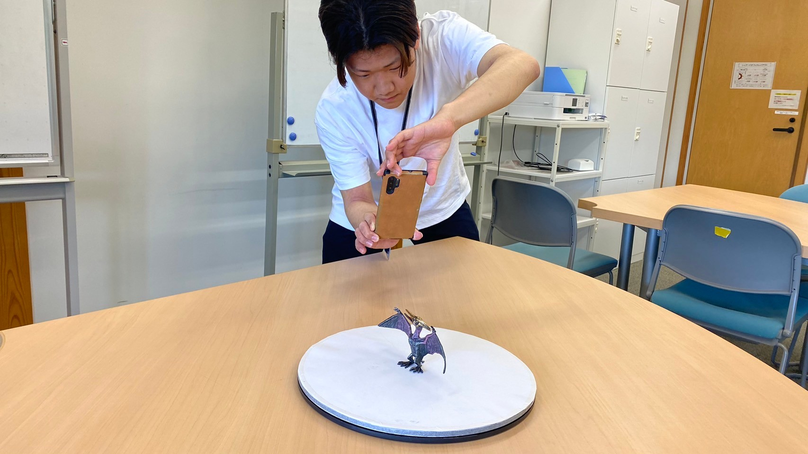
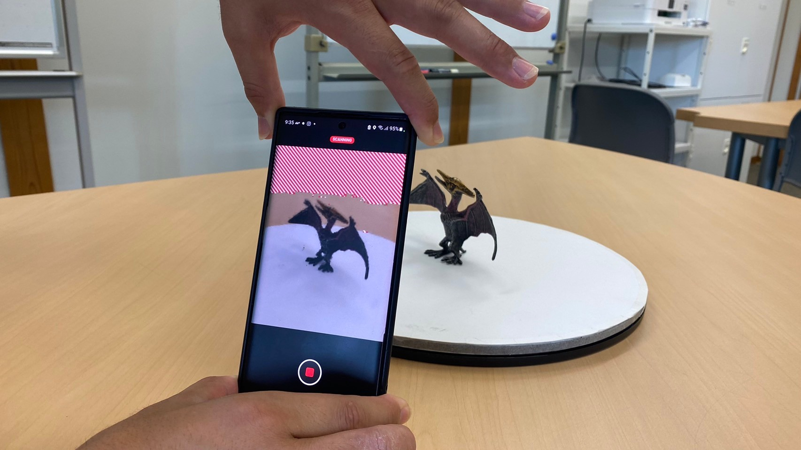
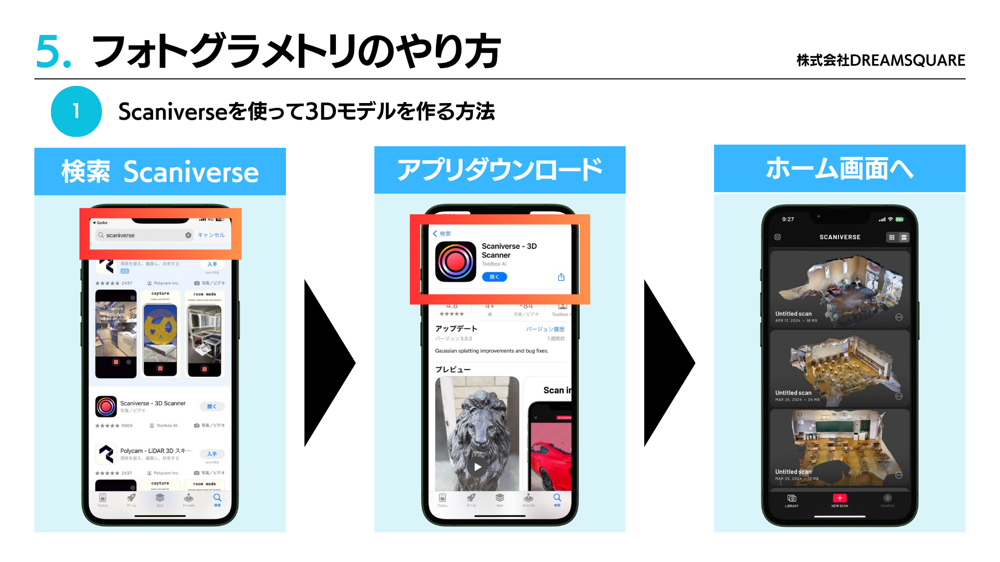
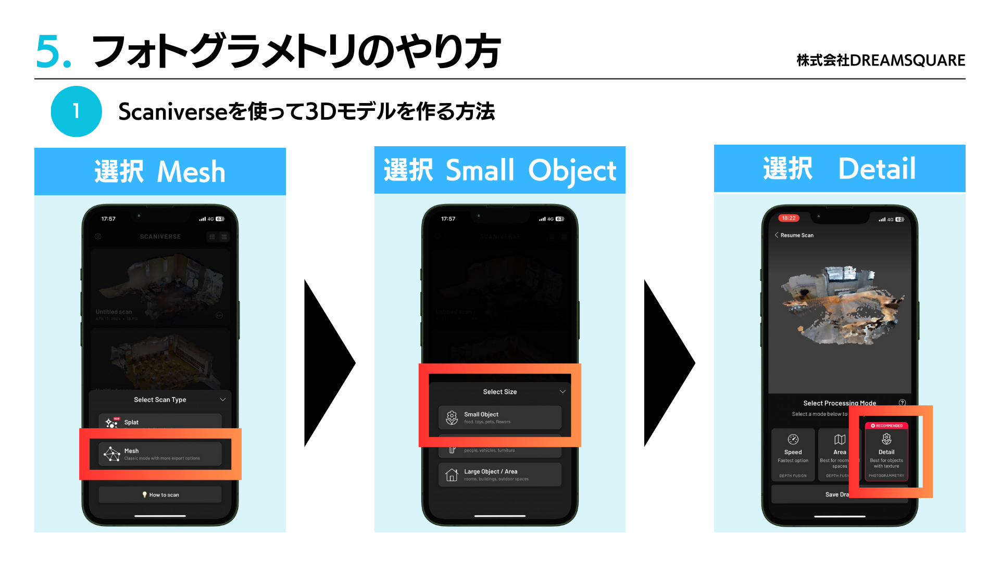
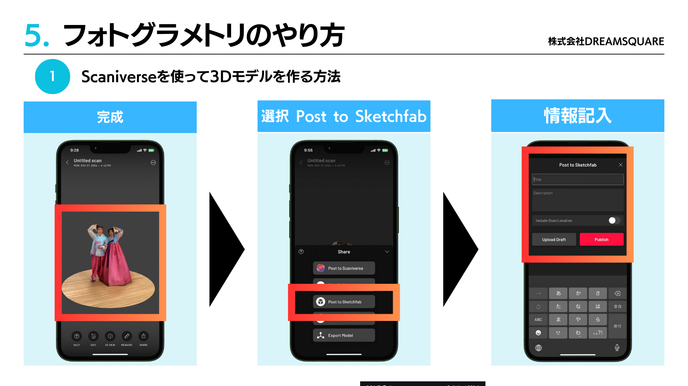

# Scaniverseの使い方

## 0. Scaniverse概要

- ### 0.1. Scaniverseって何？（小学3年生以下向け）

    **Scaniverse**は、スマホで簡単に3Dスキャンができるアプリです。**おもちゃ**や**部屋**全体を3Dで保存し、友達に見せたり、オンラインで共有したりできます。例えば、お気に入りのフィギュアを3Dモデルにして、ゲーム内で使えるかもしれません。

    

- ### 0.2. Scaniverseを使うと何ができるの？

    Scaniverseを使うと、自分の身の回りのものを3Dスキャンして立体的に保存できます。例えば、ペットや家の中、学校の工作をスキャンして、立体的なモデルにしてみましょう。そのモデルは、友達とシェアしたり、3Dプリントすることもできます。

- ### 0.3. 無料で利用可能

    Scaniverseは**基本無料**で利用できます。多くの機能が無料で使えますが、プロフェッショナルな機能を使いたい場合は、有料のオプションもあります。

## 1. 準備

- ### 1.1. アプリの起動

    まず、**スマホ**で「Scaniverse」を検索し、App StoreまたはGoogle Playからダウンロードします。おうちの人に手伝ってもらって、一緒にダウンロードしましょう。

- ### 1.2. アカウントの作成

    アプリをインストールしたら、次にアカウントを作成します。自分専用のユーザーネームとパスワードを作り、安全に利用するためにおうちの人と一緒に設定しましょう。

- ### 1.3. 初めてのログイン

    アカウントを作成したら、**ログイン**してみましょう。Scaniverseの世界に入ることができ、様々な3Dスキャン機能を試せます。

## 2. 対象のオブジェクトの写真を撮影

- ### 2.1. 写真を撮る準備

    Scaniverseで3Dスキャンしたい物を選びます。例えば、**恐竜のフィギュア**や**お気に入りのおもちゃ**をスキャンしてみましょう。明るい場所に置き、周囲に障害物がないようにしましょう。

    

- ### 2.2. 写真の撮り方

    Scaniverseアプリを開き、カメラ機能で対象物の周りをぐるっと回って写真を撮ります。30枚以上の写真を撮ると、より良い3Dモデルが作れます。

    

- ### 2.3. 写真の確認

    撮った写真がきれいに撮れているか確認しましょう。ぼやけている写真や暗すぎる写真はもう一度撮り直します。きれいな写真が多いほど、良い3Dモデルができます。

    

## 3. 写真の取り込み

- ### 3.1. 写真をScaniverseに取り込む

    写真を撮ったら、Scaniverseアプリでその写真を取り込みます。アプリの指示に従って写真を選び、アップロードします。少し時間がかかりますが、その間に他の写真も撮ってみると楽しいです。

    

- ### 3.2. 写真の確認と編集

    取り込んだ写真を確認し、必要なら編集します。不要な部分をカットしたり、明るさを調整したりできます。

    

- ### 3.3. 3Dモデルの生成

    写真の取り込みと編集が終わったら、3Dモデルを生成します。アプリの「3Dモデルを作成」ボタンを押してしばらく待ちます。どんな立体になるか楽しみですね！
    

## 4. 処理設定と実行

- ### 4.1. モデルの詳細設定

    3Dモデルができたら、さらに詳細な設定をします。例えば、モデルのサイズを変更したり、色を調整したりできます。自分の作品をもっとかっこよくするために、いろいろ試してみましょう。

- ### 4.2. 最終確認

    設定が終わったら、最終確認をします。3Dモデルが自分の思い通りになっているかしっかりチェックします。問題があれば、もう一度設定を見直します。

- ### 4.3. 処理の実行

    最終確認が終わったら、処理を実行します。アプリの「処理開始」ボタンを押してしばらく待ちます。モデルが完成するまで少し時間がかかりますが、焦らず待ちましょう。

## 5. 3Dオブジェクトのダウンロード

- ### 5.1. ダウンロードの準備

    3Dモデルが完成したら、ダウンロードします。アプリ内で保存場所を選びます。例えば、スマホのフォルダやクラウドサービスに保存できます。

    

- ### 5.2. 3Dモデルのダウンロード

    ダウンロードボタンを押して、自分のスマホやタブレットに3Dモデルを保存します。保存した3Dモデルは、いつでも見たり、友達に見せたりできます。

- ### 5.3. 共有と活用

    ダウンロードした3Dモデルを友達や家族に見せてみましょう。オンラインで共有したり、SNSにアップロードしたりして、自分の作品をみんなに見てもらいましょう。どんな反応がもらえるか楽しみですね！

